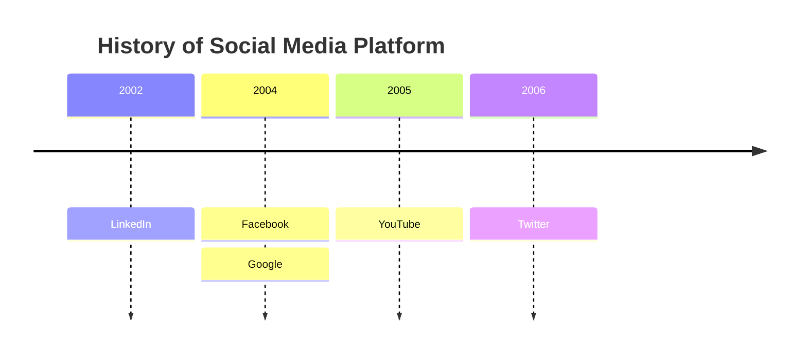

An h1 header
============

Paragraphs are separated by a blank line.

2nd paragraph. *Italic*, **bold**, and `monospace`. Itemized lists
look like:

  * this one
  * that one
  * the other one

Note that --- not considering the asterisk --- the actual text
content starts at 4-columns in.

> Block quotes are
> written like so.
>
> They can span multiple paragraphs,
> if you like.

Use 3 dashes for an em-dash. Use 2 dashes for ranges (ex., "it's all
in chapters 12--14"). Three dots ... will be converted to an ellipsis.
Unicode is supported. ☺

| Left-aligned | Center-aligned | Right-aligned |
| :---         |     :---:      |          ---: |
| git status   | git status     | git status    |
| git diff     | git diff       | git diff      |



An h2 header
------------

Here's a numbered list:

 1. first item
 2. second item
 3. third item

 ```mermaid
 ---
title: Example Git diagram
---
gitGraph
   commit
   commit
   branch develop
   checkout develop
   commit
   commit
   checkout main
   merge develop
   commit
   commit
 ```

Note again how the actual text starts at 4 columns in (4 characters
from the left side). Here's a code sample:

    # Let me re-iterate ...
    for i in 1 .. 10 { do-something(i) }

As you probably guessed, indented 4 spaces. By the way, instead of
indenting the block, you can use delimited blocks, if you like:

~~~
define foobar() {
    print "Welcome to flavor country!";
}
~~~

(which makes copying & pasting easier). You can optionally mark the
delimited block for Pandoc to syntax highlight it:

```python
import time
# Quick, count to ten!
for i in range(10):
    # (but not *too* quick)
    time.sleep(0.5)
    print i
```

```javascript
marked.use(markedHighlight({
  langPrefix: 'hljs language-',
  highlight(code, lang) {
    const language = hljs.getLanguage(lang) ? lang : 'plaintext';
    return hljs.highlight(code, { language }).value;
  }
}));
```


### An h3 header ###

Now a nested list:

 1. First, get these ingredients:

      * carrots
      * celery
      * lentils

 2. Boil some water.

 3. Dump everything in the pot and follow
    this algorithm:

        find wooden spoon
        uncover pot
        stir
        cover pot
        balance wooden spoon precariously on pot handle
        wait 10 minutes
        goto first step (or shut off burner when done)

    Do not bump wooden spoon or it will fall.

Notice again how text always lines up on 4-space indents (including
that last line which continues item 3 above).

Here's a link to [a website](http://foo.bar), to a [local
doc](local-doc.html), and to a [section heading in the current
doc](#an-h2-header). Here's a footnote [^1].

[^1]: Footnote text goes here.

Tables can look like this:

size  material      color
----  ------------  ------------
9     leather       brown
10    hemp canvas   natural
11    glass         transparent

Table: Shoes, their sizes, and what they're made of

(The above is the caption for the table.) Pandoc also supports
multi-line tables:

--------  -----------------------
keyword   text
--------  -----------------------
red       Sunsets, apples, and
          other red or reddish
          things.

green     Leaves, grass, frogs
          and other things it's
          not easy being.
--------  -----------------------

A horizontal rule follows.

***

Here's a definition list:

apples
  : Good for making applesauce.
oranges
  : Citrus!
tomatoes
  : There's no "e" in tomatoe.

Again, text is indented 4 spaces. (Put a blank line between each
term/definition pair to spread things out more.)

Here's a "line block":

| Line one
|   Line too
| Line tree

and images can be specified like so:


Inline math equations go in like so: $\omega = d\phi / dt$. Display
math should get its own line and be put in in double-dollarsigns:

$$I = \int \rho R^{2} dV$$

And note that you can backslash-escape any punctuation characters
which you wish to be displayed literally, ex.: \`foo\`, \*bar\*, etc.

### Subscript and Superscript Examples

Chemical formulas with subscript: H~2~O, CO~2~, C~6~H~12~O~6~

Mathematical expressions with superscript: X^2^, E=mc^2^, a^n^+b^n^=c^n^

Combined usage: The equation x^2^ + y^2^ = r^2^ describes a circle.

### KaTeX Math Rendering Examples

Inline math with KaTeX: The quadratic formula is $x = \frac{-b \pm \sqrt{b^2-4ac}}{2a}$ which solves $ax^2 + bx + c = 0$.

More inline examples: Einstein's famous equation $E = mc^2$, and the Pythagorean theorem $a^2 + b^2 = c^2$.

Display math (block):

$$
\int_{-\infty}^{\infty} e^{-x^2} dx = \sqrt{\pi}
$$

Complex equation:

$$
f(x) = \int_{-\infty}^\infty \hat{f}(\xi) e^{2\pi i \xi x} d\xi
$$

Matrix example:

$$
\begin{pmatrix}
a & b \\
c & d
\end{pmatrix}
$$

Sum notation:

$$
\sum_{n=1}^{\infty} \frac{1}{n^2} = \frac{\pi^2}{6}
$$

### Footnote Examples

Here's a sentence with a footnote.[^1] You can also use named footnotes[^2] for better organization.

Multiple references to the same footnote are supported.[^1]

Footnotes can contain **formatted** text and `code`.[^3]

[^1]: This is the first footnote with simple text.

[^2]: This is a named footnote. You can use any identifier you want.

[^3]: This footnote contains **bold text**, *italic text*, and `inline code`. You can also include [links](https://example.com) in footnotes!

